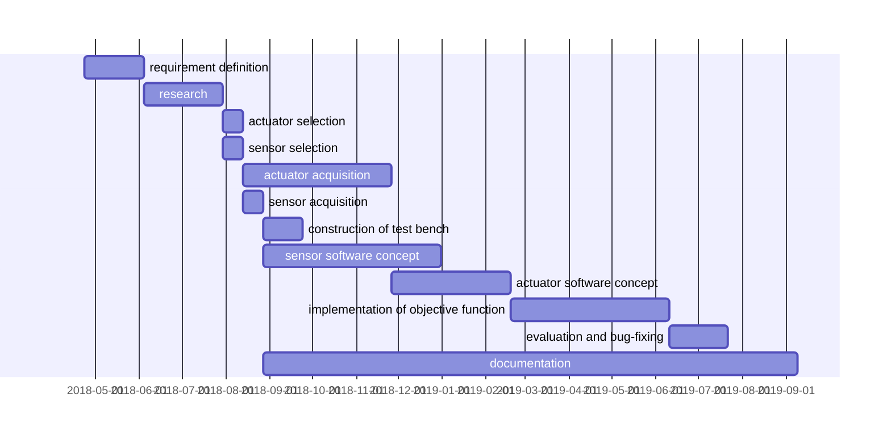
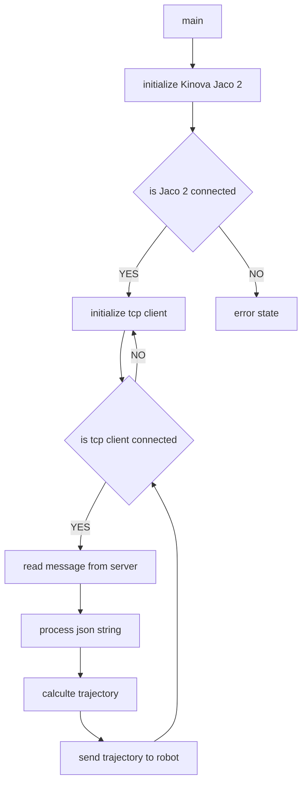
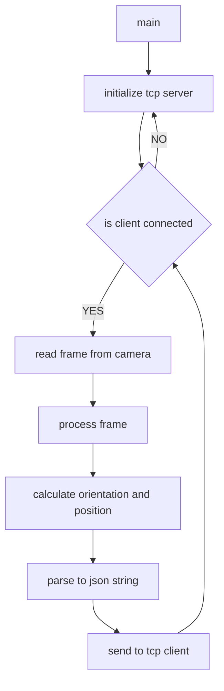

# Software-Repository Documentation


# Progress




# Table of Contents
1. [Software](#Software)
      1. [Controller](#Controller)
      2. [Camera](#Camera)
1. [Dependencies](#Dependencies)
      1. [OpenCV](#OpenCV)
      2. [OpenNI](#OpenNI)
      3. [Eigen](#Eigen)
      4. [JsonCpp](#JsonCpp)
2. [Tutorials](#Tutorials)
    1. [Build project with make](#Build-project-with-make)
        1. [Installation](#Installation)
        2. [Usage](#Usage)
        3. [Output](#Output)
    2. [Code Commenting](#Code_Commenting)
        1. [Header files](#Header-files)
        2. [Source files](#Source-files)
    3. [Doxygen](#Doxygen)
        1. [Installation](#Installation)
        2. [Usage](#Usage)
        3. [Output](#Output)
        4. [Import to Gitlab](#Import-to-Gitlab)
    4. [Markdown](#Markdown)
4. [Python](#Python)
    1. [Controller](#Controller)
        1. [Wrapping KINOVA API](#Wrapping-KINOVA-API)
    2. [Camera](#Camera)
        1. [Required packages](#Required_packages)


# 1. Software

This repository contains the arm-keyhole coordination that can be divided into two sub categories. The documentation files for the software are stored separately in the same path.

## 1.1 Controller

Based on the Kinova Jaco2 this module consists of a TCP client,
multiple PID controllers and the Kinova API in order to link between camera signals and robot motion.



 Members                        | Descriptions                                
--------------------------------|---------------------------------------------
`class `[`ExponentialFilter`](#classExponentialFilter) | A simple exponential Filter class.
`class `[`KinovaJaco2`](#classKinovaJaco2) | A wrapper class that provides easy access to the Kinova API.
`class `[`PIDController`](#classPIDController) | A simple PID controller class.
`class `[`TCPClient`](#classTCPClient) | A simple TCP client class.


### Controller Dependencies

1. Kinova API
2. Eigen
3. JsonCpp


## 1.2 Camera

Using the open source computer vision library OpenCV this module calculates information about the keyhole position and orientation. All information are passed to the Controller via the integrated TCP server.



### Summary

 Members                        | Descriptions                                
--------------------------------|---------------------------------------------
`class `[`TCPServer`](#classTCPServer) | A simple TCP server class.


### Camera Dependencies

1. OpenCV
3. JsonCpp


# 2. Dependencies

In order to build this project successfully a couple
of libraries need to be installed.


## 2.1 OpenCV

An open source computer vision library.
More information on OpenCV can be found [here](https://opencv.org/).
And for usage with depth cameras [here](https://docs.opencv.org/3.3.0/d7/d6f/tutorial_kinect_openni.html).

1. Open a Terminal and install tools

	```console
	user@computer: sudo apt-get install git cmake libgtk2.0-dev pkg-config libavcodec-dev libavformat-dev
	```


2. Format external drive

	This step is only necessary if the system does not have enought memory to build opencv
	The drive must be in ext4 format to support symbolic linking.

	```console
	user@computer: sudo mkfs.ext4 /dev/<sda-name>
	```


3. Create and enter git directory

	Clone the git repository to the external drive if step 2. applied.

	```console
	user@computer: mkdir <git-directory>
	user@computer: cd <git-directory>
	```

4. Clone OpenCV repository

	```console
	user@computer: git clone https://github.com/opencv/opencv.git
	```

5. Create and enter build directory in opencv directory

	```console
	user@computer: cd opencv
	user@computer: mkdir build
	user@computer: cd build
	```

6. Generate makefile with cmake

	Precompiled headers can be disabled if the system does not have enpught memory.

	```console
	user@computer: sudo cmake -D ENABLE_PRECOMPILED_HEADERS=OFF -D CMAKE_BUILD_TYPE=Release -D CMAKE_INSTALL_PREFIX=/usr/local ..
	```

7. Build OpenCV

	This step might take a while.

	```console
	user@computer: make -j4
	```

8. Install OpenCV

	```console
	user@computer: make install
	```


## 2.2 OpenNi

1. Install dependancies

	```console
	user@computer: sudo apt-get install freeglut3 freeglut3-dev
	```

2. Download OpenNI for Orbbec Persee

	```console
	user@computer: wget http://www.orbbec3d.net/Tools_SDK_OpenNI/2-Linux.zip
	```

3. Unzip and enter downloaded directory

	```console
	user@computer: unzip 2-Linux.zip
	user@computer: cd 2-Linux
	```

4. Unzip sub directory and enter location

	```console
	user@computer: unzip OpenNI-Linux-x64-2.3.zip -d ~/OpenNi
	user@computer: cd ~/OpenNi/OpenNi-Linux-x64-2.3
	```

4. Install

	```console
	user@computer: sudo chmod a+x install.sh
	user@computer: sudo ./install.sh
	user@computer: source OpenNIDevEnvironment
	```

## 2.3 Eigen

A open source template library for linear algebra: matrices, vectors, numerical solvers, and related algorithms.
More information on Eigen can be found [here](http://eigen.tuxfamily.org/index.php?title=Main_Page#Overview).

Installation via terminal:

```console
user@computer: sudo apt-get install libeigen3-dev
```

## 2.4 JsonCpp

A Json parser for c++.
More information on JsonCpp can be found [here](https://en.wikibooks.org/wiki/JsonCpp).

Installation via terminal:
```console
user@computer: sudo apt-get install libjsoncpp-dev
```


# 3. Tutorials

## 3.1 Build project with make

To simplify the build process of c/c++ applications a makefile can be used.
This file contains all the instructions necessary to manage and build the project.


### 3.1.1  Installation


1. Open a Terminal and install make

	```console
	user@computer: sudo apt-get install make
	```


### 3.1.2 Usage

1. Go to your project home

	```console
	user@computer: cd /path/to/project/home
	```

2. Create a build directory

	```console
	user@computer: mkdir <build-directory>
	```

3. Write a make file

	```Makefile
	# source directory
	SDIR=./src (.c .cpp)

	# binary or executable directory
	BDIR=./bin

	# example source direcotry (.c .cpp)
	EDIR=./example

	# documentation directory for doxygen
	DDIR=./doc

	# include directory (.h .hpp)
	IDIR=-I./include -I/usr/include -I/usr/local/include -I/usr/local/include/opencv4

	# librarie directorie (.o .so)
	LDIR=-L./lib -L/usr/lib -L/usr/local/lib -L/usr/local/lib -L./lib/OpenNI2/Drivers/

	# libraries to look for in librarie directory
	libs= -ldl -ljsoncpp -lopencv_core -lopencv_highgui -lopencv_videoio -lopencv_imgproc -lopencv_imgcodecs -lOniFile -lOpenNI2 -lorbbec -lPSLink

	# tells the linker to include librariy paths
	# this means LD_LIBRARY_PATH does not need to be modifyed before executen
	RPATH = -Wl,-rpath,/usr/local/lib/
	RPATH += -Wl,-rpath,lib
	RPATH += -Wl,-rpath,lib/OpenNI2/Drivers/

	# compiler
	CC=g++

	# compilter options and all paths required
	CFLAGS= -std=c++11 $(RPATH) $(IDIR) $(LDIR) $(libs)

	# make options structure
	# <tag>: <other make tags to execute before>
	#      <command 1>
	#	   <command 3>
	#
	# can be executeded using: make <tag>
	all: clean main

	# removes all generated files
	clean:
		rm -f -r $(BDIR)/*
		rm -f -r $(DDIR)/html
		rm -f -r $(DDIR)/latex
		rm -f -r $(DDIR)/xml

	# executes documentation if doxygen was setup
	documentation:
		cd $(DDIR); doxygen Camera.conf; cd ..

	# compiles main program
	main: TCPServer.o KeyholeDetection.o
		$(CC)  $(EDIR)/Camera.cpp $(BDIR)/*.o -o $(BDIR)/Camera $(CFLAGS)

	#compiles test programs
	example: TCPServer.o KeyholeDetection.o
		$(CC)  $(EDIR)/TEST_TCPServer.cpp $(BDIR)/*.o -o $(BDIR)/TEST_TCPServer $(CFLAGS)
		$(CC)  $(EDIR)/TEST_TCPServer_KinovaJaco.cpp $(BDIR)/*.o -o $(BDIR)/TEST_TCPServer_KinovaJaco $(CFLAGS)
		$(CC)  $(EDIR)/TEST_TCPServer_Json.cpp $(BDIR)/*.o -o $(BDIR)/TEST_TCPServer_Json $(CFLAGS)
		$(CC)  $(EDIR)/TEST_OpenCV.cpp $(BDIR)/*.o -o $(BDIR)/TEST_OpenCV $(CFLAGS)

	# precompiles a class to a shares object library (.so)
	TCPServer.o: $(SDIR)/TCPServer.cpp
		$(CC) -c $(SDIR)/TCPServer.cpp -o $(BDIR)/TCPServer.o $(CFLAGS)

	# precompiles a class to a shares object library (.so)
	KeyholeDetection.o: $(SDIR)/KeyholeDetection.cpp
		$(CC) -c $(SDIR)/KeyholeDetection.cpp -o $(BDIR)/KeyholeDetection.o $(CFLAGS)
	```

4. Build Project

	```console
	user@computer: make <tag>
	```
	The tag corresponse to the tags in the makefile.
	For example:
	```console
	user@computer: make documentation
	```
	would generate the documentation as define in the file and
	```console
	user@computer: make clean
	```
	would remove all generated files.
	The tag all will be used as default
	```console
	user@computer: make
	```

### 3.1.3 Output

If ALL previously described instructions were followed
the resulting structure should resemble the following file tree.

```
/path/to/project/home/
│
└───<build-directory>
│   │   <bin-file>
│
└───<lib-directory>
└───<example-directory>
└───<include-director>
└───<source-directory>
└───<documentation-directory>
```


## 3.2 Code Commenting

Doxygen needs certain style of comments in order to generate a documentation.
This section will demonstrate the documentation convention für c++ header and source files.

### 3.2.1 Header files

The main part of the documentation takes place in the header files.
This why the source implementation can be changed independently and will not impair the documentation itself.


```cpp
#ifndef _DEMOCLASS_HPP_
#define _DEMOCLASS_HPP_

/**
* Description of example that uses demo_class.
*
* @example <example-name>.cpp
*/

/**
* @brief A short description of demo_class
*
* A more detailed description of demo_class and space to elaborate on.
*/
public class demo_class
{
	private:

	int demo_int; /**< Discription of demo_int */
	double demo_double; /**< Discription of demo_double */

	public:

	/**
	* @brief demo_class constructor
	*
	* Creates and initializes demo_class.
	*
	* @param parameter1 Discription of parameter1
	* @param parameter2 Discription of parameter2
	*/
	demo_class(int parameter1, double parameter2);

	/**
	* @brief demo_class destructor
	*
	* Frees all demo_class related memory.
	*/
	~demo_class();

	/**
	* @brief A brief discription foo
	*
	* A more detailed discription of foo.
	*
	* @param parameter Discription of parameter
	*
	* @return Discription of return value
	*/
	bool foo(int parameter);

}
```


### 3.2.2 Source files

Within the source file all additional information can be added by comments.
These comments are not used by doxygen and therefore do not require a specific style.


```cpp
#include "demo_class.hpp"

demo_class::demo_class(int parameter1, double parameter2)
{
	// set demo_int to parameter1
	demo_int = parameter1;

	// set demo_double to sum of parameter1 and parameter2
 	demo_double =  parameter1 + parameter2;
}

demo_class::~demo_class()
{
	//
}

bool demo_class::foo(int parameter)
{
	// return if parameter value is larger then zero
	return parameter>0;
}

```


## 3.3 Doxygen

In order to generate a code dokumentation for a given project this
section will provide detailed instructions on all
nesseccary tools and how to use them.


### 3.3.1 Installation


1. Open a Terminal and install make

	```console
	user@computer: sudo apt-get install make
	```

2. Install doxygen

	```console
	user@computer: sudo apt-get install doxygen
	```

3. Install graphviz

	```console
	user@computer: sudo apt-get install graphviz
	```

4. Install LaTex

	```console
	user@computer: sudo apt-get install texlive-latex-base texlive-latex-extra
	```

5. Install npm and moxygen

	```console
	user@computer: sudo apt-get install npm
	user@computer: sudo npm install moxygen -g
	```


### 3.3.2 Usage

1. Go to your project home

	```console
	user@computer: cd /path/to/project/home
	```

2. Create a documentaion directory and enter it

	```console
	user@computer: mkdir <documentation-directory>
	user@computer: cd <documentation-directory>
	```

3. Generate doxygen config file

	```console
	user@computer: doxygen -g <config-name>.conf
	```

4. Edit config file

	There are a few basic settings that need to be changed in order to generate graphics.

	```console
	HAVE_DOT = YES
	CALL_GRAPH = YES
	CALLER_GRAPH = YES
	EXTRACT_ALL = YES
	```

	Set project name and a brief description for the documentation title.

	```console
	PROJECT_NAME = "your project name"
	PROJECT_BRIEF = "brief project description"
	```

	Set all the directories you want to include in the documentation.

	```console
	INPUT = ../include ../src
	```

	Set the output directory.

	```console
	OUTPUT_DIRECTORY = "./"
	```

	Choose the types of output you want to generate.

	The html output generates an index.html file that can be viewed with a browser.
	```console
	GENERATE_HTML = YES
	HTML_OUTPUT = html/
	```

	The LaTex output can be build in order to generate a PDF file.
	The generated file can be found in the latex directory as refman.pdf.
	```console
	GENERATE_LATEX= YES
	LATEX_OUTPUT = latex/
	```

	The xml output can be used to generate markdown files for git.
	```console
	GENERATE_XML = YES
	XML_OUTPUT = xml/
	```

5. Open Terminal and go to your project documentation directory

	If you want to call doxygen from an other directory you need to change all paths to absolut paths in the doxygen config.

	```console
	user@computer: cd /path/to/project/home/<documentation-directory>
	```

6. Execute doxygen

	```console
	user@computer: doxygen <config-name>.conf
	```

7. Generate PDF file from LaTex output

	```console
	user@computer: cd <latex-directory>
	user@computer: make
	user@computer: cp refman.pdf ../
	```

8. Generate markdown file from xml output

	```console
	user@computer: cd ..
	user@computer: moxygen -o <markdown-name>.md ./<xml-directory>
	```


### 3.3.3 Output

If ALL previously described instructions were followed
the resulting structure should resemble the following file tree.

```
/path/to/project/home/
│
└───<documentation-directory>
│   │   <config-name>.conf
│   │   refman.pdf
│   │   <markdown-name>.md
│   │
│   └───<html-directory>
│   │   │   index.html
│   │   │   ...
│   │   
│   └───<latex-directory>
│   │   │	refman.tex
│   │   │   ...
│   │   
│   └───<xml-directory>
│       │   ...
│       │	...
│       │   ...
│   
│	...
│
└───...
└───...
```

### 3.3.4 Import to GitLab

The markdown file can be pushed into the git wiki to be included in the git documentation.

1. Create and enter git directory

	```console
	user@computer: mkdir <git-directory>
	user@computer: cd <git-directory>
	```

2. Clone and enter wiki repository

	:exclamation: "<repository-name>.wiki" is the name of the wiki repository.

	```console
	user@computer: git clone https://gitlab.tubit.tu-berlin.de/MURMEL/<repository-name>.wiki.git
	user@computer: cd <repository-name>.wiki
	```

3. Copy markdown file into wiki repository

	Markdown files can be generated using doxygen and moxygen.

	```console
	user@computer: cp /path/to/project/home/<documentation-directory>/<markdown-name>.md ./
	```

4. Add new files to git

	```console
	user@computer: git add ./*
	```

5. Commit local changes

	```console
	user@computer: git commit -m "commit message"
	```

6. Push changes to git

	```console
	user@computer: git push origin master
	```

6. Link to a markdown file

	GitLab allows to link markdown files using page-slugs.

	```console
	[Link Title](page-slug)
	```

	page-slugs can be derived from the any file name within the git.
	- the file ending has to be removed
	- only the first letter can be capital sized


	```
	<git-directory>/<repository-name>.wiki
	│
	│    home.md
	│    Test.md
	│    TestCamelCase.md
	```

	```console
	[Link Title](home)
	[Link Title](Test)
	[Link Title](Testcamelcase)
	```


## 3.4 Markdown

Mermaid can be used in markdown files to generate graphs, time tables and more. Further instnstructions and examples can be found [here](https://mermaidjs.github.io/).


# 4. Python

For teaching and prototyping purposes a small collection of
python examples can be found in the code repository.

## 4.1 Controller

The controller software is not as far as the c++ variant.
A simple c++ Robot Wrapper was created for the KINOVA API that can be used to create a python wrapper.

### 4.1.1 Wrapping KINOVA API

A more complex tutorial on python wrapping with swig can be found [here](https://www.geeksforgeeks.org/wrapping-cc-python-using-swig-set-1/).

1. Install compiler and wrapping tools

	compiler installation
	```console
	user@computer: sudo apt install g++
	```

	Phython development tools
	```console
	user@computer: apt-get install python-dev
	```

	Wrapping tool
	```console
	user@computer: apt install swig
	```

2. Generate wrapper configuration file
	Enter the directory where the phython wrapper needs to be created.

	Use swig to generate wrapper configuration file.
	Output type: -python
	Input type: -c++
	Source directory of c++ files: -I<path/to/sourcefiles>
	Output config file: <path/to/new/config_file.i>
	```console
	user@computer: swig -python -c++ -I../src KinovaJaco2.i
	```

3. Compile and wrapp
	Enter the directory where the phython wrapper needs to be created.

	Use swig to generate wrapper configuration file.
	Output type: -python
	Input type: -c++
	Source directory of c++ files: -I<path/to/sourcefiles>
	Output config file: <path/to/new/config_file.i>
	```console
	user@computer: g++ -Wall -fPIC -c ../src/KinovaJaco2*.c* ./KinovaJaco2*.c* -I/usr/include/python2.7 -I/usr/include -I../include -I../src -L/usr/lib -L../lib -lpython2.7 -ldl
	```
	It is important to include all files. ../src/KinovaJaco2*.c* ./KinovaJaco2*.c* will also include the swig generated files because of the wild card placement. In order for g++ to compile a python output, -lpython2.7  from -I/usr/include/python2.7 has to be included as well.

4. Link files
	The compiler result has to be linked to create a shared object file for python to use.
	```console
	user@computer: g++ -shared -fPIC KinovaJaco2*.o -o _KinovaJaco2.so
	```

## 4.2 Camera

The camera can be operated only using python packages. The setup is therefore relatively easy and only requires the following packages.

### 4.2.1 Required packages

1. Python Package manager
```console
user@computer: sudo apt install python-pip
```

2. Numpy for mathematical operations
```console
user@computer: pip install numpy
```

3. OpenCV for computer vision operations
```console
user@computer: pip install opencv-python
```
