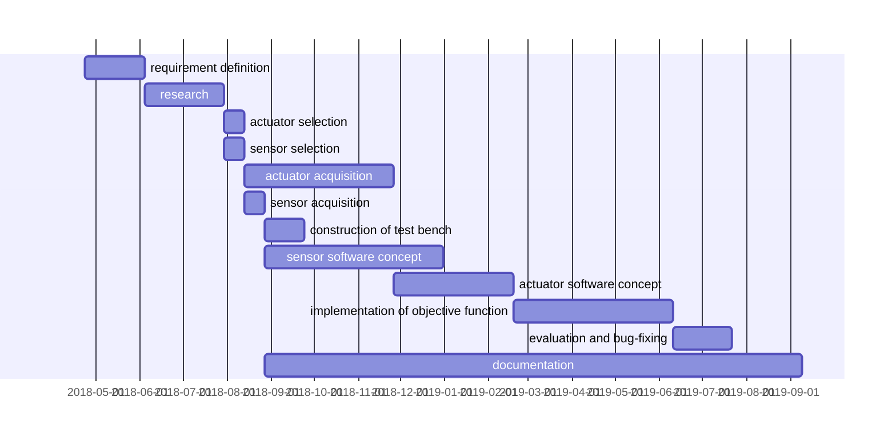
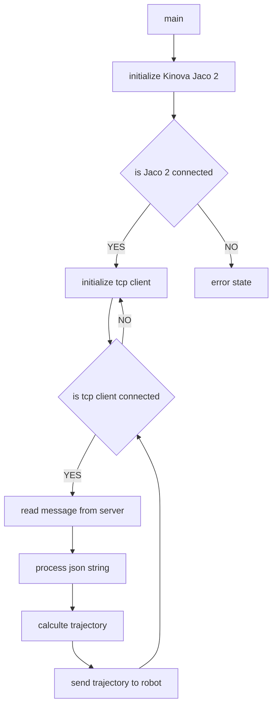
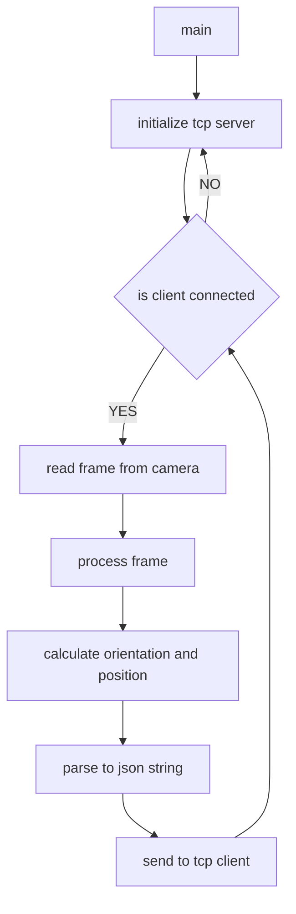

# Progress

# Software

This repository contains the arm-keyhole coordination that can be divided into two sub categories.

## Controller

Based on the Kinova Jaco2 this module consists of a TCP client,
multiple PID controllers and the Kinova API in order to link between
camera signals and robot motion.
A detailed source code documentation can be found [here](Controller).

### Dependencies

All the instructions needed can be found [here](Dependencies).

1. Kinova API
2. Eigen
3. JsonCpp

## Camera

Using the open source computer vision library OpenCV this module
calculates information about the keyhole position and orientation.
All information are passed to the Controller via the integrated TCP server.
A detailed source code documentation can be found [here](Camera).

### Dependencies

All the instructions needed can be found [here](Dependencies).

1. OpenCV
3. JsonCpp

# Dependencies

In order to build this project successfully a couple
of libraries need to be installed.
All the instructions needed can be found in the [here](Dependencies).

# Tutorials

### Build project with make

To simplify the build process of c/c++ applications a makefile can be used.
This file contains all the instructions necessary to manage and build the project.
Instructions can be found [here](Makeinstructions).

### Code Commenting

Doxygen needs certain style of comments in order to generate a documentation.
This section will demonstrate the documentation convention für c++ header and source files.
More detailed instructions can be found [here](Codecommenting).

### Doxygen

In order to generate a code dokumentation for a given project this
section will provide detailed instructions on all
nesseccary tools and how to use them.
Instructions can be found [here](Doxygeninstructions).

### Markdown

Mermaid can be used in markdown files to generate graphs, time tables and more.
Further instnstructions and examples can be found [here](https://mermaidjs.github.io/).

### Python

For teaching and prototyping purposes a small collection of
python examples can be found [here](Doxygeninstructions)
